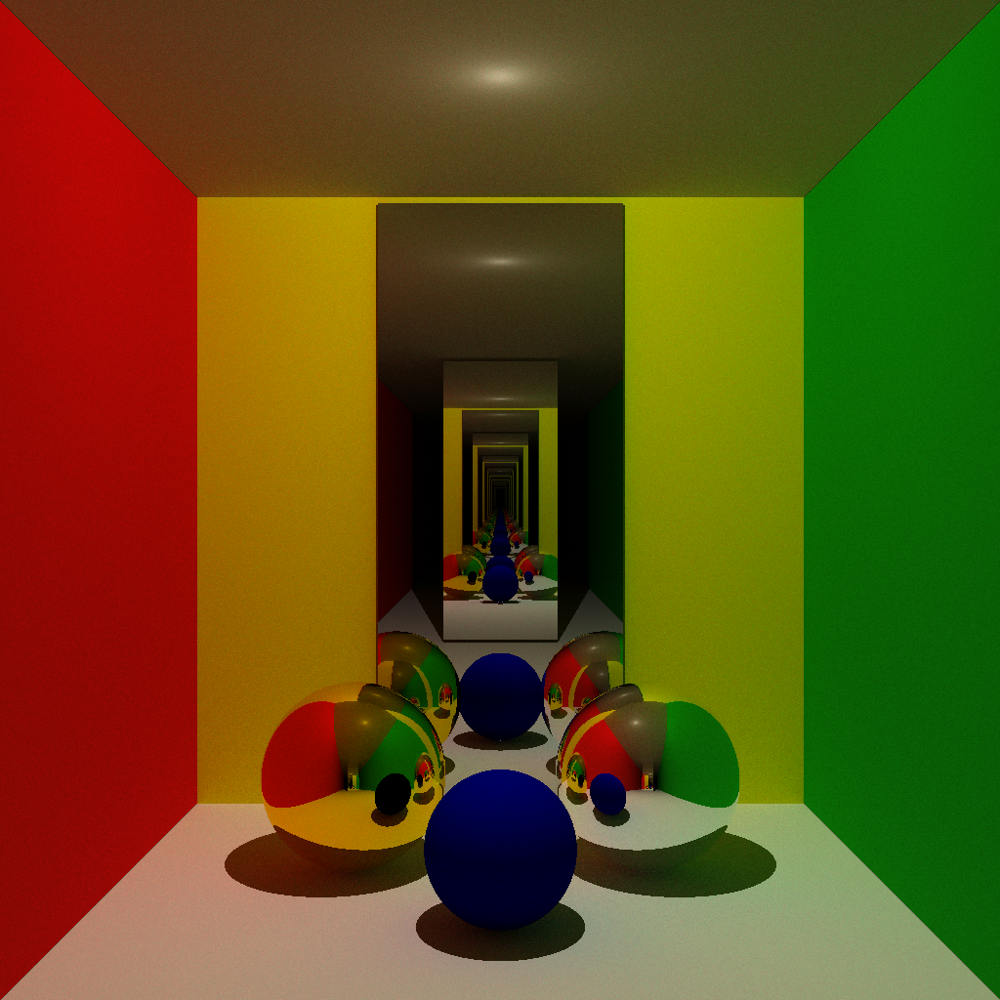
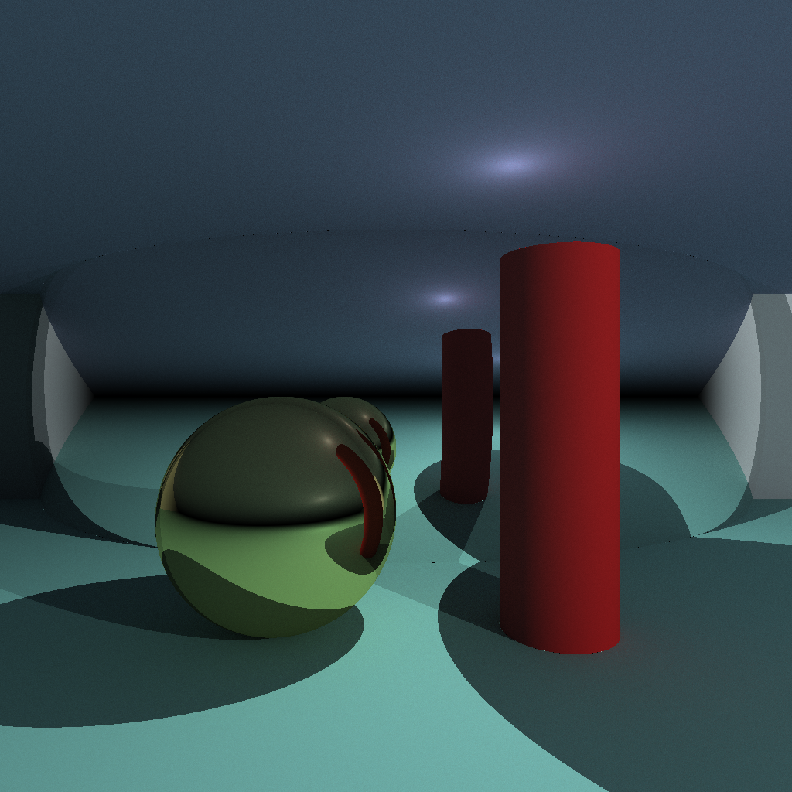
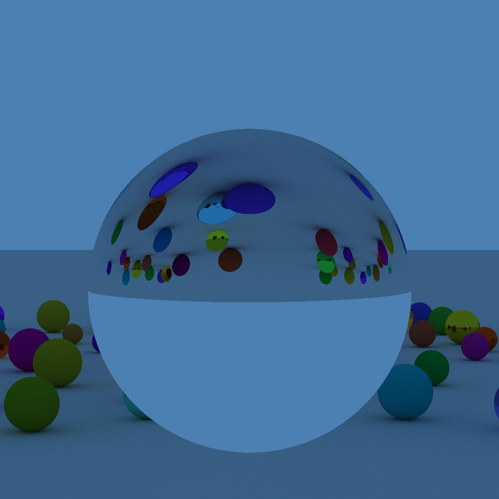

# <span style="color:white;">Ray</span><span style="color:#7c6aff;">Studio</span>
[](https://machupityu.github.io/RayStudio/)  
A path tracing raytracing engine that runs in the Web browser.
A renderer written in C is compiled to WebAssembly (WASM), allowing you to edit scenes and perform rendering from an HTML UI.

## Demo
> Rendering examples
<p align="center">
  
  
  
</p>

## Features
- Path tracing raytracing engine running on WASM
- **WebGL2 GPU renderer** — real-time progressive rendering with live preview using GLSL shaders (no compilation required)
- Ability to place spheres, infinite planes, finite planes, cylinders, and light sources
- Support for SOLID / METAL / GLASS materials
- Multiple light sources supported
- Configurable sky color (ambient background lighting)
- 3-direction views (TOP / FRONT / SIDE) to confirm objects
- Adjustable width and height resolution independently (aspect ratio support)
- Jittered sampling for smoother anti-aliasing
- Save and load scenes as JSON files
- ON/OFF toggle, duplication, and drag-and-drop reordering of objects
- Zoom and PNG save functionality for rendering results
- Undo with Ctrl+Z or the undo button

## How to Use (For Non-Programmers)
1. Open the site from [here](https://machupityu.github.io/RayStudio/)
2. Select an object from the left list and edit its properties
3. Only objects that are ON will be rendered
4. Adjust the sample count and resolution in the settings tab
5. Press the "Render" button to view the results
6. Toggle between **CPU** and **GPU** mode with the 🖥️/🚀 button in the header
7. Save as PNG with the 💾 button

## CPU vs GPU Mode

| | CPU (WASM) | GPU (WebGL2) |
|---|---|---|
| Rendering | Completes then displays | Progressive live preview |
| Speed | Slower | Much faster |
| Requires | renderer.wasm | WebGL2 support |

GPU mode renders progressively — you can see the image take shape in real time as samples accumulate.

## Build Instructions (For Developers)
### Requirements
- [Emscripten](https://emscripten.org/) 3.0 or later

### Compilation
```powershell
emcc main_wasm.c -o renderer.js `
  -s EXPORTED_FUNCTIONS="['_render','_get_buffer_size','_set_object','_set_object_count','_set_camera','_set_sky_color']" `
  -s EXPORTED_RUNTIME_METHODS="['ccall','cwrap','HEAPU8']" `
  -s ALLOW_MEMORY_GROWTH=1 `
  -O2
```
Or run the included `compile.ps1`:
```powershell
powershell -ExecutionPolicy Bypass -File compile.ps1
```

### Running Locally
```bash
python -m http.server 8080
```
Open `http://localhost:8080` in your browser.

## File Structure
```
index.html          # UI
renderer.js         # WASM wrapper (generated by emcc)
renderer.wasm       # Compiled renderer
main_wasm.c         # Renderer main body (WASM entry point)
struct_vec.h        # Vector and structure definitions
intersection.h      # Intersection detection
intersectionpoint.h # Intersection point processing
serch_light_random_d.h # Direct lighting and random reflection
compile.ps1         # Compilation script
```

## Technical Details
- Path tracing sends rays to each pixel for sampling
- Direct light sampling (with shadow detection)
- Indirect light through random hemisphere sampling
- METAL material uses specular reflection, SOLID uses Lambertian reflection
- Sky color contributes as ambient light when rays miss all objects
- **GPU renderer** uses GLSL fragment shaders with ping-pong framebuffers (RGBA32F) to accumulate samples across frames. Scene data is passed as a 64×6 RGBA32F texture. Uses PCG-based random number generation for high-quality, artifact-free noise.

## License
MIT